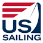
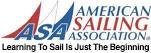

# sailing
Learning to sail

## Books

<!-- Image -->
US Sailing Association 

| Title | Edition |  Purchase   |
| ---   | --- | --- |
| [Basic Keelboat](https://www.amazon.com/gp/product/1882502213/ref=ppx_yo_dt_b_asin_title_o00_s00?ie=UTF8&psc=1) | Feb 2003 | 1/10/2020 - $1.05 + shipping |
| [Basic Keelboat](https://www.amazon.com/Basic-Keelboat-Certification-U-S-Sailing/dp/0979647703/ref=pd_sbs_14_7?_encoding=UTF8&pd_rd_i=0979647703&pd_rd_r=4771b068-4af9-4318-a918-e1a2d725c05e&pd_rd_w=itOfU&pd_rd_wg=GrW7O&pf_rd_p=bdd201df-734f-454e-883c-73b0d8ccd4c3&pf_rd_r=SJWKTJCR5YSG3PHBEYY9&psc=1&refRID=SJWKTJCR5YSG3PHBEYY9) | Feb 1, 2012 | 1/14/2020 - $6.85 |
| [Basic Cruising](https://www.amazon.com/Basic-Cruising-National-Instruction-Certification/dp/193891502X/ref=pd_sbs_14_4/146-3635083-2276919?_encoding=UTF8&pd_rd_i=193891502X&pd_rd_r=934b08a9-b29e-4738-813a-22f13519dc82&pd_rd_w=thXLq&pd_rd_wg=z5PIX&pf_rd_p=bdd201df-734f-454e-883c-73b0d8ccd4c3&pf_rd_r=4FDERZNWH403KS5V953Q&psc=1&refRID=4FDERZNWH403KS5V953Q) | Feb 15, 2013 | 1/10/2020 - $7.10 |
| [Bareboat Cruising](https://www.amazon.com/Basic-Cruising-National-Instruction-Certification/dp/193891502X/ref=pd_sbs_14_4/146-3635083-2276919?_encoding=UTF8&pd_rd_i=193891502X&pd_rd_r=934b08a9-b29e-4738-813a-22f13519dc82&pd_rd_w=thXLq&pd_rd_wg=z5PIX&pf_rd_p=bdd201df-734f-454e-883c-73b0d8ccd4c3&pf_rd_r=4FDERZNWH403KS5V953Q&psc=1&refRID=4FDERZNWH403KS5V953Q) | Dec 15, 2012 | |

<!-- Image -->
American Sailing Association 

| Title | Edition |  Textbook   | Purchase   |
| ---   | --- | --- | --- |
| [Sailing Made Easy](https://www.amazon.com/Sailing-Made-Easy-American-Association/dp/098210250X/ref=pd_sbs_14_4/146-3635083-2276919?_encoding=UTF8&pd_rd_i=098210250X&pd_rd_r=affb7b41-508d-4268-9f3b-e1dc196c65d9&pd_rd_w=dcYe4&pd_rd_wg=mTu6d&pf_rd_p=bdd201df-734f-454e-883c-73b0d8ccd4c3&pf_rd_r=P3MNJJNXCZRP6M2A5CFS&psc=1&refRID=P3MNJJNXCZRP6M2A5CFS) | Feb 1, 2010  |  ASA 101 | 1/9/2020 - $21.99 |
| [Coastal Cruising Made Easy](https://www.amazon.com/Coastal-Cruising-American-Sailing-Association/dp/0982102518/ref=pd_bxgy_14_img_2/146-3635083-2276919?_encoding=UTF8&pd_rd_i=0982102518&pd_rd_r=c21375d8-f242-4310-95c0-1d35eb55d350&pd_rd_w=5bby9&pd_rd_wg=8FxKq&pf_rd_p=09627863-9889-4290-b90a-5e9f86682449&pf_rd_r=SWEH8RWB453HX7K9Q3SK&psc=1&refRID=SWEH8RWB453HX7K9Q3SK) |  2012 | ASA 103 | |
| [Bareboat Cruising Made Easy](https://www.amazon.com/Bareboat-Cruising-American-Association-Paperback/dp/B011MCE90Q/ref=pd_bxgy_14_img_3/146-3635083-2276919?_encoding=UTF8&pd_rd_i=B011MCE90Q&pd_rd_r=39155279-f39c-4691-a050-4baab62d3f27&pd_rd_w=OAPvm&pd_rd_wg=7TzsF&pf_rd_p=09627863-9889-4290-b90a-5e9f86682449&pf_rd_r=KGMYABWTG7R2D375J782&psc=1&refRID=KGMYABWTG7R2D375J782) | 2014  | ASA 104 | |

## Sailing Clubs

* [Torrey Pines Sailing Club](http://sailtpsc.com)
* [Fairwind Yacht Club](https://www.fairwind.org/)

## Sailing Schools

* [OCC School of Sailing & Seamanship](https://occsailing.augusoft.net/)

## Torrey Pines Sailing Club (TPSC) Boats

| Boats | Qty |   Builder   | Designer |
| ---   | --- |  ---------- | -------- |
| [Victory 21](https://sailboatdata.com/sailboat/victory-21)    | 5 | Coronado Yachts | Designer: Ted Carpentier. |
| [Newport 24](https://sailboatdata.com/sailboat/neptune-24-cb) | 1 | Capttal Yachts Inc.,  | |
| [Catalina 25](https://sailboatdata.com/sailboat/catalina-25)  | 1 | Catalina Yachts.| Frank V. Butler. |
| [Catalina 27](https://sailboatdata.com/sailboat/catalina-27)  | 1 | Catalina Yachts.| Robert Finch, Frank V. Butler |

## OCC School of Sailing & Seamanship Boats

| Boats | Qty |  Builder   | Designer |
| ---   | --- | ---------- | -------- |
| [Lido 14](https://sailboatdata.com/sailboat/lido-14)     | - | W. D. Schock Corp.(USA),   | Barney Lehman/W.D. Schock. |
| [Harbor 20](https://sailboatdata.com/sailboat/harbor-20) | - | W. D. Schock Corp.(USA),   | Steven Schock |
| [Shields 30](https://sailboatdata.com/sailboat/shields)  | - | Cape Cod Shipbuilding (USA)| Sparkman & Stephens. |
| [J/105](https://sailboatdata.com/sailboat/j105)          | - | J Boats Tillotson Pearson (USA) | Johnstone |
| [Catalina 42](https://sailboatdata.com/sailboat/catalina-42)| - | Catalina Yachts (USA) | Nelson/Marek / Catalina |

## Resources

<!-- Image -->

[US Sailing Association](https://www.ussailing.org/)

<!-- Image -->

[American Sailing Association](https://asa.com/)

### On-line course

[Free Online sailing Course - Your First Sail](https://asa.com/online-sailing-course/)
